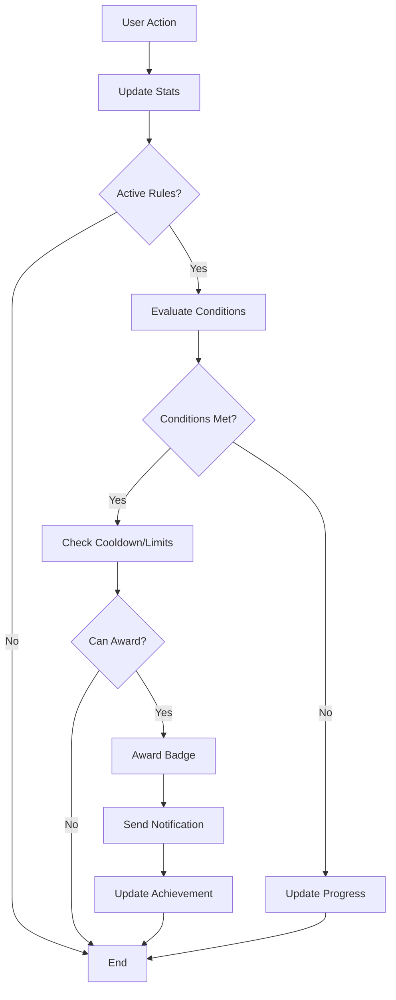

# Dynamic Badge Reward System Documentation

## Table of Contents
1. [System Overview](#system-overview)
2. [Architecture Components](#architecture-components)
3. [User Statistics Tracking](#user-statistics-tracking)
4. [Database Schema](#database-schema)
5. [Reward Rules Engine](#reward-rules-engine)
6. [Implementation Roadmap](#implementation-roadmap)
7. [API Endpoints](#api-endpoints)
8. [Admin Interface](#admin-interface)
9. [User Interface](#user-interface)
10. [Performance Considerations](#performance-considerations)
11. [Examples and Use Cases](#examples-and-use-cases)

## System Overview

The Dynamic Badge Reward System is a comprehensive achievement and recognition system that automatically awards badges to users based on their activities and milestones. The system is fully configurable through a web interface, requiring no code changes to create, modify, or manage reward rules.

### Key Features
- **Fully Dynamic**: All rules and conditions manageable through web UI
- **Real-time Tracking**: Instant badge awards when conditions are met
- **Progress Visibility**: Users can track their progress toward badges
- **Flexible Rules**: Support for complex, multi-condition achievements
- **Retroactive Awards**: Apply new rules to existing user data
- **Performance Optimized**: Efficient checking and awarding mechanisms

### System Goals
1. Increase user engagement through gamification
2. Recognize and reward valuable contributions
3. Provide clear progression paths for users
4. Enable admins to create custom achievements without developer intervention
5. Build a sense of community and accomplishment

## Architecture Components

### High-Level Architecture

```
┌─────────────────────────────────────────────────────────────┐
│                         Frontend                              │
├───────────────┬────────────────┬──────────────────────────────┤
│  User Profile │ Achievement Hub │    Admin Badge Manager      │
└───────┬───────┴────────┬───────┴──────────────┬──────────────┘
        │                │                      │
        ▼                ▼                      ▼
┌───────────────────────────────────────────────────────────────┐
│                      API Layer                                 │
├─────────────┬──────────────┬──────────────┬──────────────────┤
│ Stats API   │ Badge API    │ Rules API    │ Achievement API   │
└─────┬───────┴──────┬───────┴──────┬───────┴──────────────────┘
      │              │              │
      ▼              ▼              ▼
┌───────────────────────────────────────────────────────────────┐
│                    Database Layer                              │
├──────────┬──────────┬──────────┬──────────┬──────────────────┤
│ user_stats│  badges  │reward_rules│user_achievements│         │
└──────────┴──────────┴──────────┴──────────┴──────────────────┘
```

### Core Services

1. **Statistics Service**: Tracks and updates user metrics
2. **Rules Engine**: Evaluates conditions and triggers awards
3. **Achievement Service**: Manages badge assignments and progress
4. **Notification Service**: Alerts users of new achievements
5. **Batch Processor**: Handles scheduled and retroactive processing

## User Statistics Tracking

### Statistics Categories

#### 1. Activity Metrics
- **login_count**: Total number of logins
- **consecutive_login_days**: Current login streak
- **longest_login_streak**: Best streak achieved
- **last_login_date**: Most recent login timestamp
- **total_session_time**: Accumulated time spent on platform
- **pages_viewed**: Total page views
- **account_created_date**: Registration timestamp
- **days_since_registration**: Account age in days

#### 2. Content Creation Metrics
- **schematics_uploaded**: Total schematics created
- **schematics_updated**: Number of edits to schematics
- **blogs_written**: Blog posts authored
- **comments_posted**: Total comments made
- **addons_contributed**: Addons submitted
- **content_quality_score**: Average rating of content

#### 3. Content Consumption Metrics
- **schematics_downloaded**: Files downloaded by user
- **blogs_read**: Blog posts viewed
- **time_spent_reading**: Reading time in minutes
- **addons_installed**: Addons used by user
- **tutorials_completed**: Learning progress

#### 4. Social Metrics
- **followers_count**: Number of followers
- **following_count**: Number of users followed
- **likes_given**: Total likes distributed
- **likes_received**: Total likes on user's content
- **comments_received**: Engagement on user's content
- **shares_count**: Content shared by others

#### 5. Achievement Metrics
- **downloads_received**: Times user's content was downloaded
- **total_content_views**: Cumulative view count
- **average_rating**: Mean rating across all content
- **featured_count**: Times content was featured
- **trending_count**: Times appeared in trending

### Tracking Implementation

#### Real-time Tracking Points

```javascript
// Example tracking points in the application

// On Login
onUserLogin(userId) {
  updateStats(userId, {
    login_count: increment(1),
    last_login_date: now(),
    consecutive_login_days: calculateStreak(userId)
  });
  checkAchievements(userId, 'login');
}

// On Content Upload
onSchematicUpload(userId, schematicId) {
  updateStats(userId, {
    schematics_uploaded: increment(1)
  });
  checkAchievements(userId, 'upload');
}

// On Download
onDownload(downloaderId, contentOwnerId, contentId) {
  updateStats(downloaderId, {
    schematics_downloaded: increment(1)
  });
  updateStats(contentOwnerId, {
    downloads_received: increment(1)
  });
  checkAchievements([downloaderId, contentOwnerId], 'download');
}
```

## Database Schema

### Collection: user_stats

```typescript
{
  $id: string;
  userId: string; // Reference to user
  
  // Activity Metrics
  loginCount: number;
  consecutiveLoginDays: number;
  longestLoginStreak: number;
  lastLoginDate: datetime;
  totalSessionTime: number; // in minutes
  pagesViewed: number;
  accountCreatedDate: datetime;
  
  // Content Creation
  schematicsUploaded: number;
  schematicsUpdated: number;
  blogsWritten: number;
  commentsPosted: number;
  addonsContributed: number;
  
  // Content Consumption
  schematicsDownloaded: number;
  blogsRead: number;
  timeSpentReading: number; // in minutes
  
  // Social Metrics
  followersCount: number;
  followingCount: number;
  likesGiven: number;
  likesReceived: number;
  commentsReceived: number;
  
  // Achievement Metrics
  downloadsReceived: number;
  totalContentViews: number;
  averageRating: number;
  featuredCount: number;
  
  // Metadata
  lastUpdated: datetime;
  customMetrics: object; // Extensible for future metrics
}
```

### Collection: reward_rules

```typescript
{
  $id: string;
  name: string; // "First Schematic Master"
  description: string; // "Upload your first schematic"
  badgeId: string; // Reference to badge to award
  
  ruleType: enum {
    'milestone',    // Numeric threshold achievements
    'action',       // Specific action completion
    'time_based',   // Time-related achievements
    'combination',  // Multiple conditions
    'custom'        // Complex custom logic
  };
  
  conditions: {
    // For milestone type
    metric: string; // "schematics_uploaded"
    operator: string; // ">=", "<=", "==", "!=", ">", "<"
    value: number; // 10
    timeframe?: string; // "all_time", "monthly", "weekly", "daily"
    
    // For combination type (AND/OR logic)
    logic?: 'AND' | 'OR';
    subconditions?: Array<Condition>;
    
    // For time_based
    duration?: number; // days
    requiresStreak?: boolean;
    
    // For action type
    actionType?: string; // "profile_complete", "email_verified"
  };
  
  // Configuration
  priority: number; // Order of evaluation (lower = higher priority)
  isActive: boolean;
  isRepeatable: boolean; // Can be earned multiple times
  cooldownDays: number; // Days before can earn again
  maxAwards: number; // Maximum times can be earned
  
  // Retroactive application
  isRetroactive: boolean; // Apply to existing users
  retroactiveDate?: datetime; // Check data from this date
  
  // Display
  progressVisible: boolean; // Show progress to users
  announcement: string; // Message shown when earned
  
  // Metadata
  createdAt: datetime;
  createdBy: string; // Admin who created
  updatedAt: datetime;
  testMode: boolean; // For testing without awarding
}
```

### Collection: user_achievements

```typescript
{
  $id: string;
  userId: string;
  badgeId: string;
  ruleId: string; // Which rule triggered this
  
  // Award details
  awardedAt: datetime;
  awardedBy: string; // 'system' or admin userId
  reason: string; // Description of why awarded
  
  // Progress tracking
  progress: number; // Current progress (e.g., 7/10)
  progressMax: number; // Target for completion
  progressPercentage: number; // 0-100
  
  // For repeatable achievements
  timesEarned: number;
  lastEarnedAt: datetime;
  nextAvailableAt?: datetime; // For cooldown
  
  // Metadata
  metadata: {
    triggerEvent?: string; // What action triggered
    bonusData?: object; // Any additional context
  };
  
  // Display
  isNew: boolean; // Unread by user
  isPinned: boolean; // Featured on profile
  displayOrder: number;
}
```

### Collection: achievement_progress

```typescript
{
  $id: string;
  userId: string;
  ruleId: string;
  
  // Current progress
  currentValue: number;
  targetValue: number;
  percentage: number; // 0-100
  
  // Tracking
  startedAt: datetime;
  lastUpdatedAt: datetime;
  estimatedCompletionDate?: datetime;
  
  // Milestones for multi-tier achievements
  milestones: Array<{
    value: number;
    reachedAt?: datetime;
    reward?: string; // Intermediate rewards
  }>;
}
```

## Reward Rules Engine

### Rule Types

#### 1. Milestone Rules
Triggered when a numeric threshold is reached.

```javascript
{
  ruleType: 'milestone',
  conditions: {
    metric: 'schematics_uploaded',
    operator: '>=',
    value: 10,
    timeframe: 'all_time'
  }
}
```

Examples:
- Upload 10 schematics → "Prolific Builder"
- Receive 100 downloads → "Popular Creator"
- Get 50 followers → "Community Leader"

#### 2. Action Rules
Triggered by specific user actions.

```javascript
{
  ruleType: 'action',
  conditions: {
    actionType: 'profile_complete',
    requiredFields: ['avatar', 'bio', 'skills']
  }
}
```

Examples:
- Complete profile → "Profile Pro"
- Verify email → "Verified Member"
- First upload → "First Steps"

#### 3. Time-Based Rules
Triggered by time-related achievements.

```javascript
{
  ruleType: 'time_based',
  conditions: {
    metric: 'consecutive_login_days',
    operator: '>=',
    value: 7,
    requiresStreak: true
  }
}
```

Examples:
- 7-day login streak → "Week Warrior"
- Member for 1 year → "Veteran"
- Active in last 30 days → "Regular"

#### 4. Combination Rules
Multiple conditions with AND/OR logic.

```javascript
{
  ruleType: 'combination',
  conditions: {
    logic: 'AND',
    subconditions: [
      {
        metric: 'schematics_uploaded',
        operator: '>=',
        value: 5
      },
      {
        metric: 'average_rating',
        operator: '>=',
        value: 4.0
      }
    ]
  }
}
```

Examples:
- 5 schematics AND 4+ rating → "Quality Creator"
- 100 downloads OR 50 likes → "Popular Content"

### Rules Processing Flow



## Implementation Roadmap

### Phase 1: Foundation (Week 1-2)
- [ ] Create database collections
- [ ] Set up user_stats tracking
- [ ] Implement basic stat updates
- [ ] Create badge CRUD operations

### Phase 2: Rules Engine (Week 3-4)
- [ ] Build rule evaluation system
- [ ] Implement milestone rules
- [ ] Add action rules
- [ ] Create time-based rules
- [ ] Develop combination logic

### Phase 3: Admin Interface (Week 5-6)
- [ ] Create rule builder UI
- [ ] Add condition editor
- [ ] Implement rule testing
- [ ] Build badge assignment tool
- [ ] Add bulk operations

### Phase 4: User Features (Week 7-8)
- [ ] Create achievement center
- [ ] Add progress tracking
- [ ] Build badge showcase
- [ ] Implement notifications
- [ ] Add achievement feed

### Phase 5: Optimization (Week 9-10)
- [ ] Add caching layer
- [ ] Optimize queries
- [ ] Implement batch processing
- [ ] Add performance monitoring
- [ ] Create analytics dashboard

## API Endpoints

### Statistics Endpoints

```typescript
// Get user statistics
GET /api/stats/user/:userId
Response: UserStats

// Update user statistics
POST /api/stats/user/:userId/update
Body: { metric: string, value: number, operation: 'set' | 'increment' }

// Get leaderboard
GET /api/stats/leaderboard
Query: { metric: string, limit: number, timeframe: string }

// Get statistics summary
GET /api/stats/summary/:userId
Response: { totalBadges: number, recentAchievements: [], nextBadges: [] }
```

### Badge Endpoints

```typescript
// List all badges
GET /api/badges
Query: { active: boolean, rarity: string, category: string }

// Get badge details
GET /api/badges/:badgeId

// Create badge (admin)
POST /api/badges
Body: BadgeSchema

// Update badge (admin)
PUT /api/badges/:badgeId
Body: Partial<BadgeSchema>

// Delete badge (admin)
DELETE /api/badges/:badgeId
```

### Rules Endpoints

```typescript
// List reward rules
GET /api/rules
Query: { active: boolean, type: string }

// Get rule details
GET /api/rules/:ruleId

// Create rule (admin)
POST /api/rules
Body: RewardRuleSchema

// Test rule (admin)
POST /api/rules/:ruleId/test
Body: { userId: string }
Response: { wouldAward: boolean, reason: string }

// Apply rule retroactively (admin)
POST /api/rules/:ruleId/apply-retroactive
Body: { userIds?: string[], fromDate?: datetime }
```

### Achievement Endpoints

```typescript
// Get user achievements
GET /api/achievements/user/:userId
Query: { includeProgress: boolean }

// Get achievement progress
GET /api/achievements/progress/:userId
Query: { ruleId?: string }

// Award badge manually (admin)
POST /api/achievements/award
Body: { userId: string, badgeId: string, reason: string }

// Revoke badge (admin)
DELETE /api/achievements/:achievementId
```

## Admin Interface

### Rule Builder Components

#### 1. Visual Rule Editor
```
┌─────────────────────────────────────────────────┐
│  Create New Rule                                 │
├─────────────────────────────────────────────────┤
│  Name: [First Upload Master                   ] │
│  Badge: [Select Badge ▼]                        │
│  Type:  ○ Milestone ● Action ○ Time ○ Combo    │
│                                                  │
│  ┌─ Conditions ────────────────────────────┐   │
│  │  When user's [schematics_uploaded ▼]     │   │
│  │  is [greater than or equal ▼]            │   │
│  │  to [1_____]                              │   │
│  │  within [all time ▼]                     │   │
│  └───────────────────────────────────────────┘   │
│                                                  │
│  ☑ Active  ☐ Repeatable  ☐ Retroactive         │
│                                                  │
│  [Test Rule]  [Save]  [Cancel]                  │
└─────────────────────────────────────────────────┘
```

#### 2. Rule Testing Interface
```
┌─────────────────────────────────────────────────┐
│  Test Rule: "First Upload Master"               │
├─────────────────────────────────────────────────┤
│  Select User: [Search users...        ▼]        │
│                                                  │
│  Test Results:                                  │
│  ┌────────────────────────────────────────┐     │
│  │ ✓ User has 5 schematics uploaded        │     │
│  │ ✓ Condition met: uploads >= 1           │     │
│  │ ✓ User hasn't received this badge yet   │     │
│  │                                          │     │
│  │ Result: Badge WOULD BE AWARDED           │     │
│  └────────────────────────────────────────┘     │
│                                                  │
│  [Apply to User]  [Close]                       │
└─────────────────────────────────────────────────┘
```

#### 3. Batch Operations
```
┌─────────────────────────────────────────────────┐
│  Retroactive Rule Application                   │
├─────────────────────────────────────────────────┤
│  Rule: "Veteran Member"                         │
│                                                  │
│  Analysis:                                      │
│  • 47 users qualify for this badge              │
│  • Date range: Jan 1, 2024 - Present            │
│  • Estimated processing time: 2 minutes         │
│                                                  │
│  ☑ Send notifications                           │
│  ☐ Test mode (no actual awards)                │
│                                                  │
│  [Preview Users]  [Apply to All]  [Cancel]      │
└─────────────────────────────────────────────────┘
```

## User Interface

### Achievement Center
```
┌─────────────────────────────────────────────────┐
│  🏆 Achievement Center                           │
├─────────────────────────────────────────────────┤
│  Your Progress                                  │
│                                                  │
│  [====>     ] Prolific Builder                  │
│  7/10 schematics uploaded                       │
│                                                  │
│  [=========>] Community Leader                  │
│  45/50 followers                                │
│                                                  │
│  ┌─ Recent Achievements ──────────────────┐     │
│  │ 🎖️ First Steps - Yesterday              │     │
│  │ ⭐ Quality Creator - 3 days ago         │     │
│  │ 🏅 Week Warrior - Last week             │     │
│  └─────────────────────────────────────────┘     │
│                                                  │
│  [View All Badges]  [My Stats]                  │
└─────────────────────────────────────────────────┘
```

### Profile Badge Display
```
┌─────────────────────────────────────────────────┐
│  User Profile - @builder_master                 │
├─────────────────────────────────────────────────┤
│  ┌─ Featured Badges ─────────────────────┐      │
│  │ 🏆 💎 ⭐ 🎖️ 🏅                        │      │
│  └────────────────────────────────────────┘      │
│                                                  │
│  Achievements: 15 badges earned                 │
│  Rarest: Legendary Creator (0.1% of users)      │
│                                                  │
│  [View All Achievements]                        │
└─────────────────────────────────────────────────┘
```

## Performance Considerations

### Optimization Strategies

#### 1. Database Indexing
```javascript
// Indexes needed for performance
user_stats: {
  indexes: [
    { userId: 1 },
    { 'userId, lastUpdated': 1 }
  ]
}

user_achievements: {
  indexes: [
    { userId: 1 },
    { 'userId, badgeId': 1 },
    { 'userId, isNew': 1 }
  ]
}

reward_rules: {
  indexes: [
    { isActive: 1 },
    { 'isActive, priority': 1 }
  ]
}
```

#### 2. Caching Strategy
- Cache user stats for 5 minutes
- Cache badge definitions for 1 hour
- Cache rule definitions for 30 minutes
- Invalidate on updates

#### 3. Batch Processing
```javascript
// Process achievements in batches
async function batchProcessAchievements() {
  const batchSize = 100;
  const users = await getUserBatch(batchSize);
  
  for (const user of users) {
    await processUserAchievements(user);
    await delay(100); // Prevent overload
  }
}
```

#### 4. Rate Limiting
- Limit stat updates to 1 per second per user
- Batch multiple stat updates when possible
- Use queues for non-critical updates

### Performance Metrics

Monitor these key metrics:
- Average rule evaluation time
- Badge award processing time
- Stats update latency
- Database query performance
- Cache hit rates

## Examples and Use Cases

### Example 1: Creating a "Super Creator" Badge

**Requirement**: User must have uploaded 10+ schematics with an average rating of 4.5+

```javascript
{
  name: "Super Creator",
  description: "Upload 10+ high-quality schematics",
  badgeId: "badge_super_creator",
  ruleType: "combination",
  conditions: {
    logic: "AND",
    subconditions: [
      {
        metric: "schematics_uploaded",
        operator: ">=",
        value: 10,
        timeframe: "all_time"
      },
      {
        metric: "average_rating",
        operator: ">=",
        value: 4.5
      }
    ]
  },
  priority: 10,
  isActive: true,
  isRepeatable: false,
  progressVisible: true,
  announcement: "Congratulations! You're a Super Creator!"
}
```

### Example 2: Seasonal Achievement

**Requirement**: Upload 5 schematics during December

```javascript
{
  name: "Holiday Builder",
  description: "Upload 5 schematics during the holiday season",
  badgeId: "badge_holiday_2024",
  ruleType: "milestone",
  conditions: {
    metric: "schematics_uploaded",
    operator: ">=",
    value: 5,
    timeframe: "custom",
    startDate: "2024-12-01",
    endDate: "2024-12-31"
  },
  priority: 5,
  isActive: true,
  isRepeatable: false,
  maxAwards: 1
}
```

### Example 3: Engagement Streak

**Requirement**: Login for 30 consecutive days

```javascript
{
  name: "Dedicated Member",
  description: "Login for 30 consecutive days",
  badgeId: "badge_dedicated",
  ruleType: "time_based",
  conditions: {
    metric: "consecutive_login_days",
    operator: ">=",
    value: 30,
    requiresStreak: true
  },
  priority: 15,
  isActive: true,
  isRepeatable: true,
  cooldownDays: 30,
  progressVisible: true
}
```

### Example 4: Community Contributor

**Requirement**: Help 10 different users by commenting on their content

```javascript
{
  name: "Community Helper",
  description: "Comment helpfully on 10 different user's content",
  badgeId: "badge_helper",
  ruleType: "action",
  conditions: {
    actionType: "unique_user_comments",
    value: 10,
    requiresPositiveFeedback: true
  },
  priority: 20,
  isActive: true,
  progressVisible: true
}
```

## Testing Strategy

### Unit Tests
- Test each rule type evaluation
- Verify stat tracking accuracy
- Check badge award logic
- Validate progress calculations

### Integration Tests
- End-to-end user action flows
- Rule evaluation with real data
- Notification delivery
- Retroactive application

### Performance Tests
- Load testing with 10k+ users
- Concurrent stat updates
- Batch processing efficiency
- Cache performance

### User Acceptance Tests
- Rule creation workflow
- Badge visibility
- Progress tracking accuracy
- Notification timing

## Monitoring and Analytics

### Key Metrics to Track
- Badge distribution across users
- Most/least earned badges
- Average time to earn badges
- User engagement changes
- Rule effectiveness

### Dashboard Views
- Real-time badge awards
- User progress overview
- Rule performance metrics
- System health indicators

## Security Considerations

### Access Control
- Only admins can create/modify rules
- Users can only view their own stats
- Rate limiting on all endpoints
- Input validation on all forms

### Data Validation
- Sanitize rule conditions
- Validate stat updates
- Prevent duplicate awards
- Check user permissions

## Future Enhancements

### Phase 2 Features
- Badge trading system
- Team achievements
- Custom badge designs
- Achievement chains (prerequisites)
- Seasonal/limited time badges

### Advanced Features
- AI-powered rule suggestions
- Predictive achievement completion
- Social sharing integration
- Badge NFT integration
- Cross-platform achievements

## Conclusion

This Dynamic Badge Reward System provides a comprehensive, flexible, and scalable solution for user engagement through gamification. By making all aspects configurable through the web interface, it empowers administrators to create and manage achievements without any coding requirements, while providing users with clear goals and recognition for their contributions to the platform.